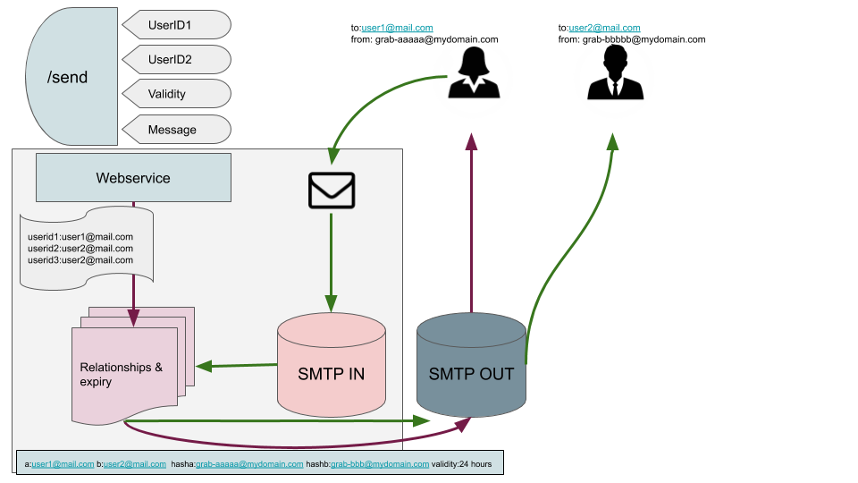

# Overview
MailGuard provides a way for setting up a link between any 2 external email addresses by assigning each of them a unique hashed email address, and proxying all communications between the parties through our MailGuard, which hides the userrs identity from each other. 
The link may be set to a default expiry, or manually expired at any time, after which mails between either user will be rejected.

# How does it work?
- Start by calling the web service to create a link between two users
- ``GET {{mailguardhost}}/send?to=002&from=003&subject=Hari demo&body=<mimemessage>``
- a lookup is done to convert the specified userid ``001`` and ``002`` into their email addresses
- we then store a link noting the hashed version of each of these emails for future lookup and routing
- this will then send an email to the ``to`` user, spoofed from a hashed mail of the ``from`` user
- those users may now communicate with each other using their regular email tools (which is proxied and rewritten via this rewriting MailGuard) for a specified period of time
- when the link expires, those communications will be rejected by the MailGuard


# Architecture


# Devbook
- current sources include .project and .classpath files for an Eclipse IDE
- ensure you have a Java 12 compatible JDK installed
- to build an executable jar using Maven command
    * ```mvn package```
    * ```mvn versions:display-dependency-updates```
    * you will find  an executable JAR file located in the docker directory `` mailguard-1.0.2-jar-with-dependencies.jar``
    
# Runbook
1. Deploy an EC2 instance in AWS
1. Log in and install Java 12
    * ```sudo apt install openjdk-12-jdk-headless```
1. To prevent running your Java server as root, set up iptables routes from 80->4777 and 25->2500
    * ```sudo iptables -t nat -A PREROUTING -i [INTERFACE] -p tcp -m tcp --dport 25 -j REDIRECT --to-ports 2500```
    * ```sudo iptables -t nat -A PREROUTING -i [INTERFACE] -p tcp -m tcp --dport 80 -j REDIRECT --to-ports 80```
1. Create a file ~/.mailguard.properties in your home directory and configure it as follows :
    * mailguard.host=ec2-11-22-33-44.eu-west-1.compute.amazonaws.com
    * mailguard.http.secret=??????????
    * mailguard.smtp.in.port=2500
    * mailguard.smtp.in.hash_prefix=sometext
1. Run the application
	* ```java -jar mailguard-1.0.2-jar 2>> mailguard.out >> mailguard.err &```
	
# Gradle manual
1. gradle -Prsa_file=/Users/stephen.johnson/.ssh/firenet-eu.pem -Psmtp_username=XXXXXXXXXXXXXXXXX -Psmtp_password=XXXXXXXXXXXXXX deploy

# Gitlab Pipeline
1. gitlab-runner exec shell deploy --env rsa_file=/Users/stephen.johnson/.ssh/firenet-eu.pem
	

# Docker
- build the executable jar as described in section Devbook
- edit the docker/mailguard.properties to ensure the hostname will be getting the right incoming address for email delivery
- from within the docker directory, build the docker image: ``docker build -t mailguard .``
- run the Docker image, exposing the smtp and http ports ``docker run -d -p80:80 -p 25:25 mailguard``
- docker push github.com:4567/stephen.johnson/mailguard

# Notes on outgoing smtp configuration

###### mailguard.smtp.out.type=direct
- the type=direct uses Aspirin to send outgoing mail. To prevent receiving smtp providers tagging these as spam, you need to set up SPF authorization
Aspirin will not pass SPF authorization because SPF looks up the DNS record for an e-mail's "from" address's host. If the ip address of the computer you're sending from doesn't match any of the appropriate DNS records in that host it will think you're spoofing the from address which is frequently a sign of spam. Unfortunately this rejects a number of valid e-mails too. For more details and a better explanation visit the SPF site.

    * ```mailguard.smtp.out.direct.expiry=120000``` to configure how long Aspirin will try to deliver the message for
    
##### mailguard.smtp.out.type=smtp
- you may use the following settings to configure an external smtp server

    * ```mailguard_smtp_out_host=smtp.xxxx.com```
    * ```mailguard_smtp_out_port=587```
    * ```mailguard_smtp_out_username=xxxx@xxxx.com``` optional
    * ```mailguard_smtp_out_password=xxxx``` optional
    
# Some possible future improvements
- explore one-to-many links, for e.g. to allow us to bulk enable communications between a partner and a segment of users
- since the system requires access to user emails, we need to figure out how to securely store this data, as well as update it when users changer their profile information
- suggest changing the code to never store the clear emails, but instead store the userid/partneruserid, and retrieve it in real time from configured user service

	